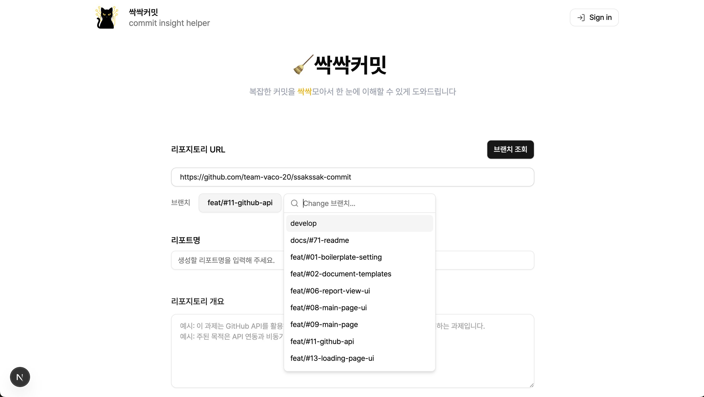
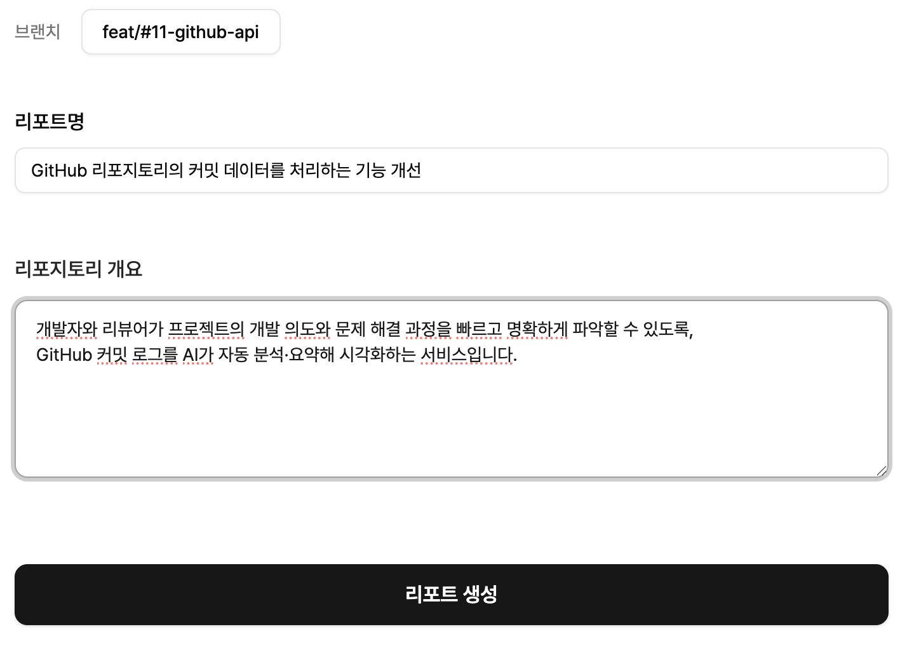
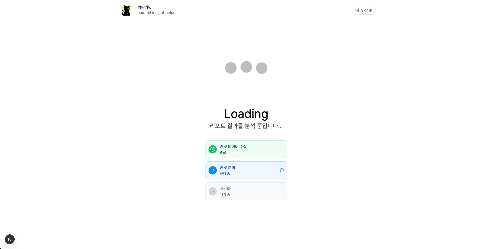
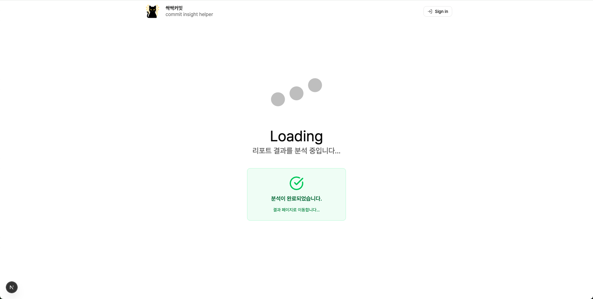
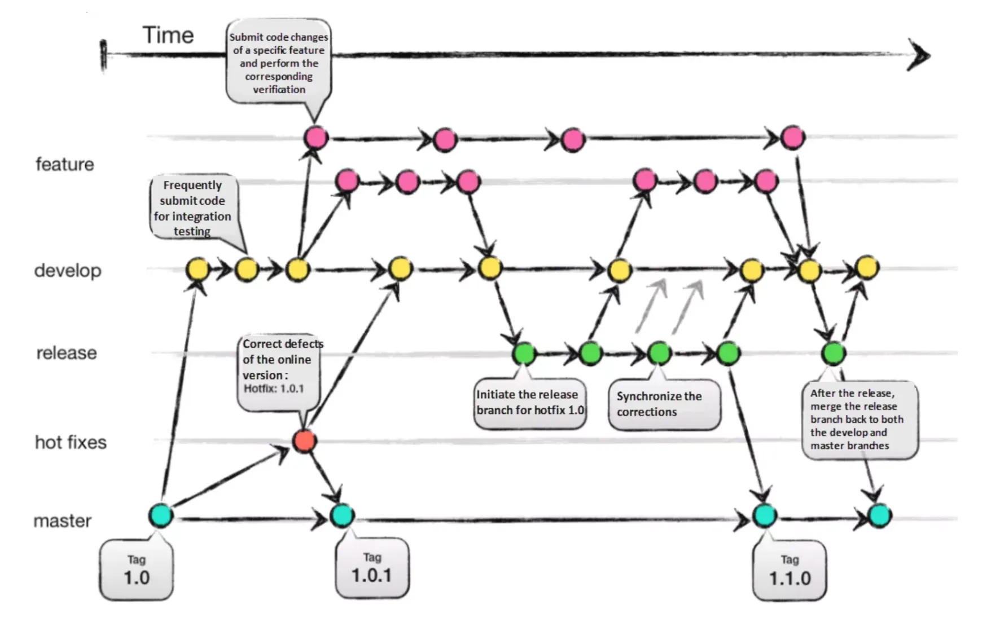

# 🧹 싹싹커밋 (Ssakssak Commit)

  

<strong>싹싹커밋(Ssakssak Commit)</strong>은 GitHub 커밋 데이터를  
AI로 분석해 사용자에게 요약 및 분석 결과를 제공하는 서비스입니다.

 

**🧑‍💼 면접관과 코드 리뷰어**  
AI 분석 리포트를 통해 지원자의 개발 과정과 의사결정 근거를 빠르게 이해할 수 있습니다.

**👨‍💻 개발자**  
커밋 흐름을 되돌아보며 프로젝트를 회고하고, 성장 과정을 기록하는 학습 자료로 활용할 수 있습니다.

 

## 목차

- [📘 프로젝트 소개](#프로젝트-소개)
  - [🗂️ 레포지토리 구조](#레포지토리-구조)

- [🚀 핵심 기능 소개](#핵심-기능-소개)
  - [1️⃣ GitHub 레포지토리 연결](#1️⃣-github-레포지토리-연결)
  - [2️⃣ 리포트 생성 요청](#2️⃣-리포트-생성-요청)
  - [3️⃣ 리포트 생성 진행 상태 표시](#3️⃣-리포트-생성-진행-상태-표시)
  - [4️⃣ 분석 결과 리포트 제공](#4️⃣-분석-결과-리포트-제공)

- [🏋️‍♀️ 기능 구현 방식 / 기술 챌린지](#기능-구현-방식--기술-챌린지)
  - [김민지](<https://github.com/ssak-three/ssakssak-commit/wiki/%F0%9F%8F%8B%EF%B8%8F%E2%80%8D%E2%99%80%EF%B8%8F-%EA%B8%B0%EB%8A%A5-%EA%B5%AC%ED%98%84-%EB%B0%A9%EC%8B%9D---%EA%B8%B0%EC%88%A0-%EC%B1%8C%EB%A6%B0%EC%A7%80(%EA%B9%80%EB%AF%BC%EC%A7%80)>)
  - [1. 대용량 커밋 로그를 안정적으로 분석하기 위한 설계](<https://github.com/ssak-three/ssakssak-commit/wiki/%F0%9F%8F%8B%EF%B8%8F%E2%80%8D%E2%99%80%EF%B8%8F-%EA%B8%B0%EB%8A%A5-%EA%B5%AC%ED%98%84-%EB%B0%A9%EC%8B%9D---%EA%B8%B0%EC%88%A0-%EC%B1%8C%EB%A6%B0%EC%A7%80(%EA%B9%80%EB%AF%BC%EC%A7%80)#1-%EB%8C%80%EC%9A%A9%EB%9F%89-%EC%BB%A4%EB%B0%8B-%EB%A1%9C%EA%B7%B8%EB%A5%BC-%EC%95%88%EC%A0%95%EC%A0%81%EC%9C%BC%EB%A1%9C-%EB%B6%84%EC%84%9D%ED%95%98%EA%B8%B0-%EC%9C%84%ED%95%9C-%EC%84%A4%EA%B3%84>)
    - [1-1. 왜 커밋 로그를 나누어야 했을까?](<https://github.com/ssak-three/ssakssak-commit/wiki/%F0%9F%8F%8B%EF%B8%8F%E2%80%8D%E2%99%80%EF%B8%8F-%EA%B8%B0%EB%8A%A5-%EA%B5%AC%ED%98%84-%EB%B0%A9%EC%8B%9D---%EA%B8%B0%EC%88%A0-%EC%B1%8C%EB%A6%B0%EC%A7%80(%EA%B9%80%EB%AF%BC%EC%A7%80)#1-1-%EC%99%9C-%EC%BB%A4%EB%B0%8B-%EB%A1%9C%EA%B7%B8%EB%A5%BC-%EB%82%98%EB%88%84%EC%96%B4%EC%95%BC-%ED%96%88%EC%9D%84%EA%B9%8C>)
    - [1-2. 커밋을 토큰 기반으로 안정적으로 분할하려면?](<https://github.com/ssak-three/ssakssak-commit/wiki/%F0%9F%8F%8B%EF%B8%8F%E2%80%8D%E2%99%80%EF%B8%8F-%EA%B8%B0%EB%8A%A5-%EA%B5%AC%ED%98%84-%EB%B0%A9%EC%8B%9D---%EA%B8%B0%EC%88%A0-%EC%B1%8C%EB%A6%B0%EC%A7%80(%EA%B9%80%EB%AF%BC%EC%A7%80)#1-2-%EC%BB%A4%EB%B0%8B%EC%9D%84-%ED%86%A0%ED%81%B0-%EA%B8%B0%EB%B0%98%EC%9C%BC%EB%A1%9C-%EC%95%88%EC%A0%95%EC%A0%81%EC%9C%BC%EB%A1%9C-%EB%B6%84%ED%95%A0%ED%95%98%EB%A0%A4%EB%A9%B4>)
    - [1-3. 배치를 병렬로-분석하기](<https://github.com/ssak-three/ssakssak-commit/wiki/%F0%9F%8F%8B%EF%B8%8F%E2%80%8D%E2%99%80%EF%B8%8F-%EA%B8%B0%EB%8A%A5-%EA%B5%AC%ED%98%84-%EB%B0%A9%EC%8B%9D---%EA%B8%B0%EC%88%A0-%EC%B1%8C%EB%A6%B0%EC%A7%80(%EA%B9%80%EB%AF%BC%EC%A7%80)#1-3-%EB%B0%B0%EC%B9%98%EB%A5%BC-%EB%B3%91%EB%A0%AC-%EB%B6%84%EC%84%9D%ED%95%98%EA%B8%B0>)
    - [1-4. 배치별 결과를 병합해 ‘하나의 리포트 흐름’으로 재구성하기](<https://github.com/ssak-three/ssakssak-commit/wiki/%F0%9F%8F%8B%EF%B8%8F%E2%80%8D%E2%99%80%EF%B8%8F-%EA%B8%B0%EB%8A%A5-%EA%B5%AC%ED%98%84-%EB%B0%A9%EC%8B%9D---%EA%B8%B0%EC%88%A0-%EC%B1%8C%EB%A6%B0%EC%A7%80(%EA%B9%80%EB%AF%BC%EC%A7%80)#1-4-%EB%B0%B0%EC%B9%98%EB%B3%84-%EA%B2%B0%EA%B3%BC%EB%A5%BC-%EB%B3%91%ED%95%A9%ED%95%B4-%ED%95%98%EB%82%98%EC%9D%98-%EB%A6%AC%ED%8F%AC%ED%8A%B8-%ED%9D%90%EB%A6%84%EC%9C%BC%EB%A1%9C-%EC%9E%AC%EA%B5%AC%EC%84%B1%ED%95%98%EA%B8%B0>)
  - [2. 서버가 멈추지 않는 비동기 작업 처리 구조](<https://github.com/ssak-three/ssakssak-commit/wiki/%F0%9F%8F%8B%EF%B8%8F%E2%80%8D%E2%99%80%EF%B8%8F-%EA%B8%B0%EB%8A%A5-%EA%B5%AC%ED%98%84-%EB%B0%A9%EC%8B%9D---%EA%B8%B0%EC%88%A0-%EC%B1%8C%EB%A6%B0%EC%A7%80(%EA%B9%80%EB%AF%BC%EC%A7%80)#2-%EC%84%9C%EB%B2%84%EA%B0%80-%EB%A9%88%EC%B6%94%EC%A7%80-%EC%95%8A%EB%8A%94-%EB%B9%84%EB%8F%99%EA%B8%B0-%EC%9E%91%EC%97%85-%EC%B2%98%EB%A6%AC-%EA%B5%AC%EC%A1%B0>)
    - [2-1. 긴 AI 분석 작업이 서버를 멈추게 만든 이유](<https://github.com/ssak-three/ssakssak-commit/wiki/%F0%9F%8F%8B%EF%B8%8F%E2%80%8D%E2%99%80%EF%B8%8F-%EA%B8%B0%EB%8A%A5-%EA%B5%AC%ED%98%84-%EB%B0%A9%EC%8B%9D---%EA%B8%B0%EC%88%A0-%EC%B1%8C%EB%A6%B0%EC%A7%80(%EA%B9%80%EB%AF%BC%EC%A7%80)#2-1-%EA%B8%B4-ai-%EB%B6%84%EC%84%9D-%EC%9E%91%EC%97%85%EC%9D%B4-%EC%84%9C%EB%B2%84%EB%A5%BC-%EB%A9%88%EC%B6%94%EA%B2%8C-%EB%A7%8C%EB%93%A0-%EC%9D%B4%EC%9C%A0>)
    - [2-2. Queue–Worker 구조로 요청과 처리 분리하기](<https://github.com/ssak-three/ssakssak-commit/wiki/%F0%9F%8F%8B%EF%B8%8F%E2%80%8D%E2%99%80%EF%B8%8F-%EA%B8%B0%EB%8A%A5-%EA%B5%AC%ED%98%84-%EB%B0%A9%EC%8B%9D---%EA%B8%B0%EC%88%A0-%EC%B1%8C%EB%A6%B0%EC%A7%80(%EA%B9%80%EB%AF%BC%EC%A7%80)#2-2-queueworker-%EA%B5%AC%EC%A1%B0%EB%A1%9C-%EC%9A%94%EC%B2%AD%EA%B3%BC-%EC%B2%98%EB%A6%AC-%EB%B6%84%EB%A6%AC%ED%95%98%EA%B8%B0>)
    - [2-3. 자동 재시도로 실패 복구 기반 다지기](<https://github.com/ssak-three/ssakssak-commit/wiki/%F0%9F%8F%8B%EF%B8%8F%E2%80%8D%E2%99%80%EF%B8%8F-%EA%B8%B0%EB%8A%A5-%EA%B5%AC%ED%98%84-%EB%B0%A9%EC%8B%9D---%EA%B8%B0%EC%88%A0-%EC%B1%8C%EB%A6%B0%EC%A7%80(%EA%B9%80%EB%AF%BC%EC%A7%80)#2-3-%EC%9E%90%EB%8F%99-%EC%9E%AC%EC%8B%9C%EB%8F%84%EB%A1%9C-%EC%8B%A4%ED%8C%A8-%EB%B3%B5%EA%B5%AC-%EA%B8%B0%EB%B0%98-%EB%8B%A4%EC%A7%80%EA%B8%B0>)
    - [2-4. 재시작배포-시-진행-상태-유실을-막고-진행률-추적으로-상태-관리하기](<https://github.com/ssak-three/ssakssak-commit/wiki/%F0%9F%8F%8B%EF%B8%8F%E2%80%8D%E2%99%80%EF%B8%8F-%EA%B8%B0%EB%8A%A5-%EA%B5%AC%ED%98%84-%EB%B0%A9%EC%8B%9D---%EA%B8%B0%EC%88%A0-%EC%B1%8C%EB%A6%B0%EC%A7%80(%EA%B9%80%EB%AF%BC%EC%A7%80)#2-4-%EC%9E%AC%EC%8B%9C%EC%9E%91%EB%B0%B0%ED%8F%AC-%EC%8B%9C-%EC%A7%84%ED%96%89-%EC%83%81%ED%83%9C-%EC%9C%A0%EC%8B%A4%EC%9D%84-%EB%A7%89%EA%B3%A0-%EC%A7%84%ED%96%89%EB%A5%A0-%EC%B6%94%EC%A0%81%EC%9C%BC%EB%A1%9C-%EC%83%81%ED%83%9C-%EA%B4%80%EB%A6%AC%ED%95%98%EA%B8%B0>)
  - [이한세](#)
  - [조혜주](#조혜주)
    - [1. 사용자가 더 쉽게 자신의 저장소를 연결할 수 없을까?](#사용자가-더-쉽게-자신의-저장소를-연결할-수-없을까)
      - [1-1. 세밀한 권한 제어를 위해 도입했던 GitHub App의 한계](#세밀한-권한-제어를-위해-도입했던-github-app의-한계)
      - [1-2. OAuth 전환으로 접근 과정을 단순화하다](#oauth-전환으로-접근-과정을-단순화하다)
      - [1-3. OAuth 기반 인증 구조 구현 과정](#oauth-기반-인증-구조-구현-과정)
    - [2. 리포트 생성 과정을 더 안전하고 일관되게 만들 수 있을까?](#리포트-생성-과정을-더-안전하고-일관되게-만들-수-있을까)
      - [2-1. 분산된 요청 흐름으로 인한 보안성과 일관성 문제](#분산된-요청-흐름으로-인한-보안성과-일관성-문제)
      - [2-2. 서버 트랜잭션으로 통합해 흐름을 단일화하다](#서버-트랜잭션으로-통합해-흐름을-단일화하다)
      - [2-3. 안정적인 서버 주도 트랜잭션 구조로 개선하다](#안정적인-서버-주도-트랜잭션-구조로-개선하다)

- [🛠️ 기술 스택](#기술-스택)
  - [🖥️ 프론트엔드](#️-프론트엔드)
  - [⚙️ 백엔드](#️-백엔드)
  - [📀 데이터](#-데이터)
  - [🤖 AI & 오케스트레이션](#-ai--오케스트레이션)
  - [🚀 배포](#-배포)

- [🪄 작업 방식 / 회고](#작업-방식--회고)
  - [⚡️ 깃 브랜치 전략](#️-깃-브랜치-전략)
  - [📝 PR 규칙](#-pr-규칙)
  - [💭 개인 회고](#-개인-회고)

- [🔨 리팩토링 항목](#리팩토링-항목)

- [👥 팀원](#-팀원)

 
 

## 📘 프로젝트 소개 

### 🗂️ 레포지토리 구조

<pre>
  ├── prisma/                  # Prisma 스키마 및 마이그레이션 관리
  │   └── schema.prisma
  ├── public/                  # 정적 리소스 (로고, 에러 이미지 등)
  ├── src/
  │   ├── app/                 # Next.js App Router (UI + API 통합 라우팅)
  │   │   ├── (routes)/        # 페이지 라우팅 그룹 (홈, 리포트, 로그인 등)
  │   │   └── api/             # 백엔드 API 엔드포인트 (Next.js API Route)
  │   ├── constants/           # 공통 상수, 설정값, 밸리데이션 정의
  │   ├── errors/              # 커스텀 에러 클래스 정의
  │   ├── hooks/               # 커스텀 훅
  │   ├── infra/               # 인프라 레벨(캐시, 메시징, 외부 연동) 코드
  │   ├── lib/                 # 공용 유틸, 인증, 로거, 파서 등 핵심 로직
  │   ├── repositories/        # 데이터 접근 계층 (Prisma 기반)
  │   ├── services/            # 비즈니스 로직 (커밋 분석, 리포트 생성 등)
  │   ├── stores/              # Zustand 기반 전역 상태 관리
  │   └── types/               # 전역 타입 정의
  ├── tsconfig.json
  └── package.json
</pre>

싹싹커밋은 **Next.js 기반의 단일 레포지토리(모놀리식 구조)** 로,  
src/app 내부에 UI(Route)와 백엔드(API) 를 함께 구성하여  
프론트엔드·백엔드·DB·AI 분석 로직을 하나의 파이프라인으로 통합한 구조입니다.

 
 

## 🚀 핵심 기능 소개 

### 1️⃣ GitHub 레포지토리 연결

GitHub 레포지토리 URL 입력 시 브랜치 목록이 자동으로 조회되어 분석 대상을 간편하게 선택할 수 있습니다.  
`Public` 및 로그인 시 `Private` 레포지토리 까지 모두 연결 가능합니다.

 

### 2️⃣ 리포트 생성 요청

리포트 이름과 레포지토리 개요를 입력하고 생성 버튼을 클릭하면  
AI 분석 요청과 리포트 생성이 한 번에 진행됩니다.

- 리포트명을 입력해 원하는 이름으로 리포트 생성
- 프로젝트 개요 작성 시 맥락 기반 AI 분석 제공

 

### 3️⃣ 리포트 생성 진행 상태 표시

리포트 생성 중인 진행 상황을 시각적으로 확인할 수 있습니다.

|                                     분석 진행 중                                     |                                      분석 완료                                       |
| :----------------------------------------------------------------------------------: | :----------------------------------------------------------------------------------: |
|  |  |

 

### 4️⃣ 분석 결과 리포트 제공

AI가 커밋을 분석해

- 주요 변경 요약
- 커밋 분석 내용에 맞는 다이어그램(플로우 차트, 시퀀스 다이어그램, 클래스 다이어그램)
- 주요 code diff(수정 내역)
- 커밋 목록(클릭 시 해당 커밋 분석 내용으로 이동)
- 해당 커밋 GitHub 링크
- 해당 레포지토리 링크

등을 리포트 형태로 시각화해 보여줍니다.

 
 

## 🛠️ 기술 스택 

### 🖥️ 프론트엔드

 

### ⚙️ 백엔드

 

### 📀 데이터

 

### 🤖 AI & 오케스트레이션

 

### 🚀 배포

###

> 🔗 세부 기술 선정 이유 및 대안 비교는 Wiki에서 확인할 수 있습니다.  
> [프론트엔드](https://github.com/team-vaco-20/ssakssak-commit/wiki/%F0%9F%9B%A0%EF%B8%8F-%EA%B8%B0%EC%88%A0-%EC%8A%A4%ED%83%9D#1-%EF%B8%8F-front-end) · [백엔드](https://github.com/team-vaco-20/ssakssak-commit/wiki/%F0%9F%9B%A0%EF%B8%8F-%EA%B8%B0%EC%88%A0-%EC%8A%A4%ED%83%9D#2-%EF%B8%8F-back-end) · [데이터](https://github.com/team-vaco-20/ssakssak-commit/wiki/%F0%9F%9B%A0%EF%B8%8F-%EA%B8%B0%EC%88%A0-%EC%8A%A4%ED%83%9D#3--%EB%8D%B0%EC%9D%B4%ED%84%B0) ·[AI & 오케스트레이션](https://github.com/team-vaco-20/ssakssak-commit/wiki/%F0%9F%9B%A0%EF%B8%8F-%EA%B8%B0%EC%88%A0-%EC%8A%A4%ED%83%9D#4--ai--%EC%98%A4%EC%BC%80%EC%8A%A4%ED%8A%B8%EB%A0%88%EC%9D%B4%EC%85%98) · [배포](https://github.com/team-vaco-20/ssakssak-commit/wiki/%F0%9F%9B%A0%EF%B8%8F-%EA%B8%B0%EC%88%A0-%EC%8A%A4%ED%83%9D#5--%EB%B0%B0%ED%8F%AC)

 

## 🏋️‍♀️ 기능 구현 방식 / 기술 챌린지 

> 🔗 해당 내용을 클릭하시면 Wiki에서 세부 내용을 확인할 수 있습니다.

### [💁‍♀️ 김민지](<https://github.com/team-vaco-20/ssakssak-commit/wiki/%F0%9F%8F%8B%EF%B8%8F%E2%80%8D%E2%99%80%EF%B8%8F-%EA%B8%B0%EB%8A%A5-%EA%B5%AC%ED%98%84-%EB%B0%A9%EC%8B%9D---%EA%B8%B0%EC%88%A0-%EC%B1%8C%EB%A6%B0%EC%A7%80(%EA%B9%80%EB%AF%BC%EC%A7%80)>)

#### [1. 대용량 커밋 로그를 안정적으로 분석하기 위한 설계](<https://github.com/team-vaco-20/ssakssak-commit/wiki/%F0%9F%8F%8B%EF%B8%8F%E2%80%8D%E2%99%80%EF%B8%8F-%EA%B8%B0%EB%8A%A5-%EA%B5%AC%ED%98%84-%EB%B0%A9%EC%8B%9D---%EA%B8%B0%EC%88%A0-%EC%B1%8C%EB%A6%B0%EC%A7%80(%EA%B9%80%EB%AF%BC%EC%A7%80)#1-%EB%8C%80%EC%9A%A9%EB%9F%89-%EC%BB%A4%EB%B0%8B-%EB%A1%9C%EA%B7%B8%EB%A5%BC-%EC%95%88%EC%A0%95%EC%A0%81%EC%9C%BC%EB%A1%9C-%EB%B6%84%EC%84%9D%ED%95%98%EA%B8%B0-%EC%9C%84%ED%95%9C-%EC%84%A4%EA%B3%84>)

[**1-1. 왜 커밋 로그를 나누어야 했을까?**](<https://github.com/team-vaco-20/ssakssak-commit/wiki/%F0%9F%8F%8B%EF%B8%8F%E2%80%8D%E2%99%80%EF%B8%8F-%EA%B8%B0%EB%8A%A5-%EA%B5%AC%ED%98%84-%EB%B0%A9%EC%8B%9D---%EA%B8%B0%EC%88%A0-%EC%B1%8C%EB%A6%B0%EC%A7%80(%EA%B9%80%EB%AF%BC%EC%A7%80)#1-%EB%8C%80%EC%9A%A9%EB%9F%89-%EC%BB%A4%EB%B0%8B-%EB%A1%9C%EA%B7%B8%EB%A5%BC-%EC%95%88%EC%A0%95%EC%A0%81%EC%9C%BC%EB%A1%9C-%EB%B6%84%EC%84%9D%ED%95%98%EA%B8%B0-%EC%9C%84%ED%95%9C-%EC%84%A4%EA%B3%84>)  
[**1-2. 커밋을 토큰 기반으로 안정적으로 분할하려면?**](<https://github.com/team-vaco-20/ssakssak-commit/wiki/%F0%9F%8F%8B%EF%B8%8F%E2%80%8D%E2%99%80%EF%B8%8F-%EA%B8%B0%EB%8A%A5-%EA%B5%AC%ED%98%84-%EB%B0%A9%EC%8B%9D---%EA%B8%B0%EC%88%A0-%EC%B1%8C%EB%A6%B0%EC%A7%80(%EA%B9%80%EB%AF%BC%EC%A7%80)#1-2-%EC%BB%A4%EB%B0%8B%EC%9D%84-%ED%86%A0%ED%81%B0-%EA%B8%B0%EB%B0%98%EC%9C%BC%EB%A1%9C-%EC%95%88%EC%A0%95%EC%A0%81%EC%9C%BC%EB%A1%9C-%EB%B6%84%ED%95%A0%ED%95%98%EB%A0%A4%EB%A9%B4>)  
[**1-3. 배치를 병렬로 분석하기**](<https://github.com/team-vaco-20/ssakssak-commit/wiki/%F0%9F%8F%8B%EF%B8%8F%E2%80%8D%E2%99%80%EF%B8%8F-%EA%B8%B0%EB%8A%A5-%EA%B5%AC%ED%98%84-%EB%B0%A9%EC%8B%9D---%EA%B8%B0%EC%88%A0-%EC%B1%8C%EB%A6%B0%EC%A7%80(%EA%B9%80%EB%AF%BC%EC%A7%80)#1-3-%EB%B0%B0%EC%B9%98%EB%A5%BC-%EB%B3%91%EB%A0%AC-%EB%B6%84%EC%84%9D%ED%95%98%EA%B8%B0>)  
[**1-4. 배치별 결과를 병합해 ‘하나의 리포트 흐름’으로 재구성하기**](<https://github.com/team-vaco-20/ssakssak-commit/wiki/%F0%9F%8F%8B%EF%B8%8F%E2%80%8D%E2%99%80%EF%B8%8F-%EA%B8%B0%EB%8A%A5-%EA%B5%AC%ED%98%84-%EB%B0%A9%EC%8B%9D---%EA%B8%B0%EC%88%A0-%EC%B1%8C%EB%A6%B0%EC%A7%80(%EA%B9%80%EB%AF%BC%EC%A7%80)#1-4-%EB%B0%B0%EC%B9%98%EB%B3%84-%EA%B2%B0%EA%B3%BC%EB%A5%BC-%EB%B3%91%ED%95%A9%ED%95%B4-%ED%95%98%EB%82%98%EC%9D%98-%EB%A6%AC%ED%8F%AC%ED%8A%B8-%ED%9D%90%EB%A6%84%EC%9C%BC%EB%A1%9C-%EC%9E%AC%EA%B5%AC%EC%84%B1%ED%95%98%EA%B8%B0>)

#### [2. 서버가 멈추지 않는 비동기 작업 처리 구조](<https://github.com/team-vaco-20/ssakssak-commit/wiki/%F0%9F%8F%8B%EF%B8%8F%E2%80%8D%E2%99%80%EF%B8%8F-%EA%B8%B0%EB%8A%A5-%EA%B5%AC%ED%98%84-%EB%B0%A9%EC%8B%9D---%EA%B8%B0%EC%88%A0-%EC%B1%8C%EB%A6%B0%EC%A7%80(%EA%B9%80%EB%AF%BC%EC%A7%80)#2-%EC%84%9C%EB%B2%84%EA%B0%80-%EB%A9%88%EC%B6%94%EC%A7%80-%EC%95%8A%EB%8A%94-%EB%B9%84%EB%8F%99%EA%B8%B0-%EC%9E%91%EC%97%85-%EC%B2%98%EB%A6%AC-%EA%B5%AC%EC%A1%B0>)

[**2-1. 긴 AI 분석 작업이 서버를 멈추게 만든 이유**](<https://github.com/team-vaco-20/ssakssak-commit/wiki/%F0%9F%8F%8B%EF%B8%8F%E2%80%8D%E2%99%80%EF%B8%8F-%EA%B8%B0%EB%8A%A5-%EA%B5%AC%ED%98%84-%EB%B0%A9%EC%8B%9D---%EA%B8%B0%EC%88%A0-%EC%B1%8C%EB%A6%B0%EC%A7%80(%EA%B9%80%EB%AF%BC%EC%A7%80)#2-%EC%84%9C%EB%B2%84%EA%B0%80-%EB%A9%88%EC%B6%94%EC%A7%80-%EC%95%8A%EB%8A%94-%EB%B9%84%EB%8F%99%EA%B8%B0-%EC%9E%91%EC%97%85-%EC%B2%98%EB%A6%AC-%EA%B5%AC%EC%A1%B0>)  
[**2-2. Queue–Worker 구조로 요청과 처리 분리하기**](<https://github.com/team-vaco-20/ssakssak-commit/wiki/%F0%9F%8F%8B%EF%B8%8F%E2%80%8D%E2%99%80%EF%B8%8F-%EA%B8%B0%EB%8A%A5-%EA%B5%AC%ED%98%84-%EB%B0%A9%EC%8B%9D---%EA%B8%B0%EC%88%A0-%EC%B1%8C%EB%A6%B0%EC%A7%80(%EA%B9%80%EB%AF%BC%EC%A7%80)#2-%EC%84%9C%EB%B2%84%EA%B0%80-%EB%A9%88%EC%B6%94%EC%A7%80-%EC%95%8A%EB%8A%94-%EB%B9%84%EB%8F%99%EA%B8%B0-%EC%9E%91%EC%97%85-%EC%B2%98%EB%A6%AC-%EA%B5%AC%EC%A1%B0>)  
[**2-3. 자동 재시도로 실패 복구 기반 다지기**](<https://github.com/team-vaco-20/ssakssak-commit/wiki/%F0%9F%8F%8B%EF%B8%8F%E2%80%8D%E2%99%80%EF%B8%8F-%EA%B8%B0%EB%8A%A5-%EA%B5%AC%ED%98%84-%EB%B0%A9%EC%8B%9D---%EA%B8%B0%EC%88%A0-%EC%B1%8C%EB%A6%B0%EC%A7%80(%EA%B9%80%EB%AF%BC%EC%A7%80)#2-%EC%84%9C%EB%B2%84%EA%B0%80-%EB%A9%88%EC%B6%94%EC%A7%80-%EC%95%8A%EB%8A%94-%EB%B9%84%EB%8F%99%EA%B8%B0-%EC%9E%91%EC%97%85-%EC%B2%98%EB%A6%AC-%EA%B5%AC%EC%A1%B0>)  
[**2-4. 재시작/배포 시 진행 상태 유실을 막고 진행률 추적으로 상태 관리하기**](<https://github.com/team-vaco-20/ssakssak-commit/wiki/%F0%9F%8F%8B%EF%B8%8F%E2%80%8D%E2%99%80%EF%B8%8F-%EA%B8%B0%EB%8A%A5-%EA%B5%AC%ED%98%84-%EB%B0%A9%EC%8B%9D---%EA%B8%B0%EC%88%A0-%EC%B1%8C%EB%A6%B0%EC%A7%80(%EA%B9%80%EB%AF%BC%EC%A7%80)#2-%EC%84%9C%EB%B2%84%EA%B0%80-%EB%A9%88%EC%B6%94%EC%A7%80-%EC%95%8A%EB%8A%94-%EB%B9%84%EB%8F%99%EA%B8%B0-%EC%9E%91%EC%97%85-%EC%B2%98%EB%A6%AC-%EA%B5%AC%EC%A1%B0>)

 

### [💁 이한세](<Wiki 링크>)

#### [1. GitHub API 기반 커밋 데이터 수집 파이프라인](<https://github.com/team-vaco-20/ssakssak-commit/wiki/%F0%9F%8F%8B%EF%B8%8F%E2%80%8D%E2%99%80%EF%B8%8F-%EA%B8%B0%EB%8A%A5-%EA%B5%AC%ED%98%84-%EB%B0%A9%EC%8B%9D-%EA%B8%B0%EC%88%A0-%EC%B1%8C%EB%A6%B0%EC%A7%80-(%EC%9D%B4%ED%95%9C%EC%84%B8)#-github-api-%EA%B8%B0%EB%B0%98-%EC%BB%A4%EB%B0%8B-%EB%8D%B0%EC%9D%B4%ED%84%B0-%EC%88%98%EC%A7%91-%ED%8C%8C%EC%9D%B4%ED%94%84%EB%9D%BC%EC%9D%B8>)

[**1-1. TypeScript 타입 안정성 확보**](<https://github.com/team-vaco-20/ssakssak-commit/wiki/%F0%9F%8F%8B%EF%B8%8F%E2%80%8D%E2%99%80%EF%B8%8F-%EA%B8%B0%EB%8A%A5-%EA%B5%AC%ED%98%84-%EB%B0%A9%EC%8B%9D-%EA%B8%B0%EC%88%A0-%EC%B1%8C%EB%A6%B0%EC%A7%80-(%EC%9D%B4%ED%95%9C%EC%84%B8)#-%EA%B8%B0%EC%88%A0%EC%A0%81-%EC%B1%8C%EB%A6%B0%EC%A7%80>)  
[**1-2. GitHub API 파라미터 명명 규칙**](<https://github.com/team-vaco-20/ssakssak-commit/wiki/%F0%9F%8F%8B%EF%B8%8F%E2%80%8D%E2%99%80%EF%B8%8F-%EA%B8%B0%EB%8A%A5-%EA%B5%AC%ED%98%84-%EB%B0%A9%EC%8B%9D-%EA%B8%B0%EC%88%A0-%EC%B1%8C%EB%A6%B0%EC%A7%80-(%EC%9D%B4%ED%95%9C%EC%84%B8)#2-github-api-%ED%8C%8C%EB%9D%BC%EB%AF%B8%ED%84%B0-%EB%AA%85%EB%AA%85-%EA%B7%9C%EC%B9%99>)  
[**1-3. GitHub API Rate Limit 실시간 관리**](<https://github.com/team-vaco-20/ssakssak-commit/wiki/%F0%9F%8F%8B%EF%B8%8F%E2%80%8D%E2%99%80%EF%B8%8F-%EA%B8%B0%EB%8A%A5-%EA%B5%AC%ED%98%84-%EB%B0%A9%EC%8B%9D-%EA%B8%B0%EC%88%A0-%EC%B1%8C%EB%A6%B0%EC%A7%80-(%EC%9D%B4%ED%95%9C%EC%84%B8)#3-github-api-rate-limit-%EC%8B%A4%EC%8B%9C%EA%B0%84-%EA%B4%80%EB%A6%AC>)

#### [2. 폴링 기반 리포트 생성 상태 실시간 전달](<https://github.com/team-vaco-20/ssakssak-commit/wiki/%F0%9F%8F%8B%EF%B8%8F%E2%80%8D%E2%99%80%EF%B8%8F-%EA%B8%B0%EB%8A%A5-%EA%B5%AC%ED%98%84-%EB%B0%A9%EC%8B%9D-%EA%B8%B0%EC%88%A0-%EC%B1%8C%EB%A6%B0%EC%A7%80-(%EC%9D%B4%ED%95%9C%EC%84%B8)#-%ED%8F%B4%EB%A7%81-%EA%B8%B0%EB%B0%98-%EB%A6%AC%ED%8F%AC%ED%8A%B8-%EC%83%9D%EC%84%B1-%EC%83%81%ED%83%9C-%EC%8B%A4%EC%8B%9C%EA%B0%84-%EC%A0%84%EB%8B%AC>)

[**2-1. 3단계 상태 관리 설계**](<https://github.com/team-vaco-20/ssakssak-commit/wiki/%F0%9F%8F%8B%EF%B8%8F%E2%80%8D%E2%99%80%EF%B8%8F-%EA%B8%B0%EB%8A%A5-%EA%B5%AC%ED%98%84-%EB%B0%A9%EC%8B%9D-%EA%B8%B0%EC%88%A0-%EC%B1%8C%EB%A6%B0%EC%A7%80-(%EC%9D%B4%ED%95%9C%EC%84%B8)#1-3%EB%8B%A8%EA%B3%84-%EC%83%81%ED%83%9C-%EA%B4%80%EB%A6%AC-%EC%84%A4%EA%B3%84>)  
[**2-2. 폴링 로직 구현**](<https://github.com/team-vaco-20/ssakssak-commit/wiki/%F0%9F%8F%8B%EF%B8%8F%E2%80%8D%E2%99%80%EF%B8%8F-%EA%B8%B0%EB%8A%A5-%EA%B5%AC%ED%98%84-%EB%B0%A9%EC%8B%9D-%EA%B8%B0%EC%88%A0-%EC%B1%8C%EB%A6%B0%EC%A7%80-(%EC%9D%B4%ED%95%9C%EC%84%B8)#2-%ED%8F%B4%EB%A7%81-%EB%A1%9C%EC%A7%81-%EA%B5%AC%ED%98%84>)  
[**2-3. 시각적 진행 표시**](<https://github.com/team-vaco-20/ssakssak-commit/wiki/%F0%9F%8F%8B%EF%B8%8F%E2%80%8D%E2%99%80%EF%B8%8F-%EA%B8%B0%EB%8A%A5-%EA%B5%AC%ED%98%84-%EB%B0%A9%EC%8B%9D-%EA%B8%B0%EC%88%A0-%EC%B1%8C%EB%A6%B0%EC%A7%80-(%EC%9D%B4%ED%95%9C%EC%84%B8)#3-%EC%8B%9C%EA%B0%81%EC%A0%81-%EC%A7%84%ED%96%89-%ED%91%9C%EC%8B%9C>)
[**2-4. 서버측 상태 관리 API**](<https://github.com/team-vaco-20/ssakssak-commit/wiki/%F0%9F%8F%8B%EF%B8%8F%E2%80%8D%E2%99%80%EF%B8%8F-%EA%B8%B0%EB%8A%A5-%EA%B5%AC%ED%98%84-%EB%B0%A9%EC%8B%9D-%EA%B8%B0%EC%88%A0-%EC%B1%8C%EB%A6%B0%EC%A7%80-(%EC%9D%B4%ED%95%9C%EC%84%B8)#4-%EC%84%9C%EB%B2%84-%EC%B8%A1-%EC%83%81%ED%83%9C-%EA%B4%80%EB%A6%AC-api>)

#### [3. Monaco Editor와 다층 구조로 분석 결과 시각화](<https://github.com/team-vaco-20/ssakssak-commit/wiki/%F0%9F%8F%8B%EF%B8%8F%E2%80%8D%E2%99%80%EF%B8%8F-%EA%B8%B0%EB%8A%A5-%EA%B5%AC%ED%98%84-%EB%B0%A9%EC%8B%9D-%EA%B8%B0%EC%88%A0-%EC%B1%8C%EB%A6%B0%EC%A7%80-(%EC%9D%B4%ED%95%9C%EC%84%B8)#-monaco-editor%EC%99%80-%EB%8B%A4%EC%B8%B5-%EA%B5%AC%EC%A1%B0%EB%A1%9C-%EB%B6%84%EC%84%9D-%EA%B2%B0%EA%B3%BC-%EC%8B%9C%EA%B0%81%ED%99%94>)

[**3-1. Monaco Editor로 코드 변경 사항 시각화**](<https://github.com/team-vaco-20/ssakssak-commit/wiki/%F0%9F%8F%8B%EF%B8%8F%E2%80%8D%E2%99%80%EF%B8%8F-%EA%B8%B0%EB%8A%A5-%EA%B5%AC%ED%98%84-%EB%B0%A9%EC%8B%9D-%EA%B8%B0%EC%88%A0-%EC%B1%8C%EB%A6%B0%EC%A7%80-(%EC%9D%B4%ED%95%9C%EC%84%B8)#1-monaco-editor%EB%A1%9C-%EC%BD%94%EB%93%9C-%EB%B3%80%EA%B2%BD-%EC%82%AC%ED%95%AD-%EC%8B%9C%EA%B0%81%ED%99%94>)  
[**3-2. 기술적 챌린지**](<https://github.com/team-vaco-20/ssakssak-commit/wiki/%F0%9F%8F%8B%EF%B8%8F%E2%80%8D%E2%99%80%EF%B8%8F-%EA%B8%B0%EB%8A%A5-%EA%B5%AC%ED%98%84-%EB%B0%A9%EC%8B%9D-%EA%B8%B0%EC%88%A0-%EC%B1%8C%EB%A6%B0%EC%A7%80-(%EC%9D%B4%ED%95%9C%EC%84%B8)#2-%EA%B8%B0%EC%88%A0%EC%A0%81-%EC%B1%8C%EB%A6%B0%EC%A7%80>)  
[**3-3. Mermaid 다이어그램**](<https://github.com/team-vaco-20/ssakssak-commit/wiki/%F0%9F%8F%8B%EF%B8%8F%E2%80%8D%E2%99%80%EF%B8%8F-%EA%B8%B0%EB%8A%A5-%EA%B5%AC%ED%98%84-%EB%B0%A9%EC%8B%9D-%EA%B8%B0%EC%88%A0-%EC%B1%8C%EB%A6%B0%EC%A7%80-(%EC%9D%B4%ED%95%9C%EC%84%B8)#3-mermaid-%EB%8B%A4%EC%9D%B4%EC%96%B4%EA%B7%B8%EB%9E%A8%EC%9C%BC%EB%A1%9C-%EC%BB%A4%EB%B0%8B-%ED%9D%90%EB%A6%84-%EC%8B%9C%EA%B0%81%ED%99%94>)  
[**3-4. 텍스트 분석 요약**](<https://github.com/team-vaco-20/ssakssak-commit/wiki/%F0%9F%8F%8B%EF%B8%8F%E2%80%8D%E2%99%80%EF%B8%8F-%EA%B8%B0%EB%8A%A5-%EA%B5%AC%ED%98%84-%EB%B0%A9%EC%8B%9D-%EA%B8%B0%EC%88%A0-%EC%B1%8C%EB%A6%B0%EC%A7%80-(%EC%9D%B4%ED%95%9C%EC%84%B8)#4-%ED%85%8D%EC%8A%A4%ED%8A%B8-%EB%B6%84%EC%84%9D-%EC%9A%94%EC%95%BD>)  
[**3-5. 분석 결과 페이지 통합**](<https://github.com/team-vaco-20/ssakssak-commit/wiki/%F0%9F%8F%8B%EF%B8%8F%E2%80%8D%E2%99%80%EF%B8%8F-%EA%B8%B0%EB%8A%A5-%EA%B5%AC%ED%98%84-%EB%B0%A9%EC%8B%9D-%EA%B8%B0%EC%88%A0-%EC%B1%8C%EB%A6%B0%EC%A7%80-(%EC%9D%B4%ED%95%9C%EC%84%B8)#5-%EB%B6%84%EC%84%9D-%EA%B2%B0%EA%B3%BC-%ED%8E%98%EC%9D%B4%EC%A7%80-%ED%86%B5%ED%95%A9>)

 

### [💁‍♀️ 조혜주](<https://github.com/team-vaco-20/ssakssak-commit/wiki/%F0%9F%8F%8B%EF%B8%8F%E2%80%8D%E2%99%80%EF%B8%8F-%EA%B8%B0%EB%8A%A5-%EA%B5%AC%ED%98%84-%EB%B0%A9%EC%8B%9D-%EA%B8%B0%EC%88%A0-%EC%B1%8C%EB%A6%B0%EC%A7%80-(%EC%A1%B0%ED%98%9C%EC%A3%BC)>)

#### [1. 사용자가 더 쉽게 자신의 저장소를 연결할 수 없을까?](<https://github.com/team-vaco-20/ssakssak-commit/wiki/%F0%9F%92%8E-%EA%B8%B0%EB%8A%A5-%EA%B5%AC%ED%98%84-%EB%B0%A9%EC%8B%9D---%EA%B8%B0%EC%88%A0-%EC%B1%8C%EB%A6%B0%EC%A7%80(%EC%A1%B0%ED%98%9C%EC%A3%BC)#1-%EC%82%AC%EC%9A%A9%EC%9E%90%EA%B0%80-%EB%8D%94-%EC%89%BD%EA%B2%8C-%EC%9E%90%EC%8B%A0%EC%9D%98-%EC%A0%80%EC%9E%A5%EC%86%8C%EB%A5%BC-%EC%97%B0%EA%B2%B0%ED%95%A0-%EC%88%98-%EC%97%86%EC%9D%84%EA%B9%8C>) 

[**1-1. 세밀한 권한 제어를 위해 도입했던 GitHub App의 한계**](<https://github.com/team-vaco-20/ssakssak-commit/wiki/%F0%9F%92%8E-%EA%B8%B0%EB%8A%A5-%EA%B5%AC%ED%98%84-%EB%B0%A9%EC%8B%9D---%EA%B8%B0%EC%88%A0-%EC%B1%8C%EB%A6%B0%EC%A7%80(%EC%A1%B0%ED%98%9C%EC%A3%BC)#1-1-%EC%84%B8%EB%B0%80%ED%95%9C-%EA%B6%8C%ED%95%9C-%EC%A0%9C%EC%96%B4%EB%A5%BC-%EC%9C%84%ED%95%B4-%EB%8F%84%EC%9E%85%ED%96%88%EB%8D%98-github-app%EC%9D%98-%ED%95%9C%EA%B3%84>)   
[**1-2. OAuth 전환으로 접근 과정을 단순화하다**](<https://github.com/team-vaco-20/ssakssak-commit/wiki/%F0%9F%92%8E-%EA%B8%B0%EB%8A%A5-%EA%B5%AC%ED%98%84-%EB%B0%A9%EC%8B%9D---%EA%B8%B0%EC%88%A0-%EC%B1%8C%EB%A6%B0%EC%A7%80(%EC%A1%B0%ED%98%9C%EC%A3%BC)#1-2-oauth-%EC%A0%84%ED%99%98%EC%9C%BC%EB%A1%9C-%EC%A0%91%EA%B7%BC-%EA%B3%BC%EC%A0%95%EC%9D%84-%EB%8B%A8%EC%88%9C%ED%99%94%ED%95%98%EB%8B%A4>)   
[**1-3. OAuth 기반 인증 구조 구현 과정**](<https://github.com/team-vaco-20/ssakssak-commit/wiki/%F0%9F%92%8E-%EA%B8%B0%EB%8A%A5-%EA%B5%AC%ED%98%84-%EB%B0%A9%EC%8B%9D---%EA%B8%B0%EC%88%A0-%EC%B1%8C%EB%A6%B0%EC%A7%80(%EC%A1%B0%ED%98%9C%EC%A3%BC)#1-3-oauth-%EA%B8%B0%EB%B0%98-%EC%9D%B8%EC%A6%9D-%EA%B5%AC%EC%A1%B0-%EA%B5%AC%ED%98%84-%EA%B3%BC%EC%A0%95>) 

#### [2. 리포트 생성 과정을 더 안전하고 일관되게 만들 수 있을까?](<https://github.com/team-vaco-20/ssakssak-commit/wiki/%F0%9F%92%8E-%EA%B8%B0%EB%8A%A5-%EA%B5%AC%ED%98%84-%EB%B0%A9%EC%8B%9D---%EA%B8%B0%EC%88%A0-%EC%B1%8C%EB%A6%B0%EC%A7%80(%EC%A1%B0%ED%98%9C%EC%A3%BC)#2-%EB%A6%AC%ED%8F%AC%ED%8A%B8-%EC%83%9D%EC%84%B1-%EA%B3%BC%EC%A0%95%EC%9D%84-%EB%8D%94-%EC%95%88%EC%A0%84%ED%95%98%EA%B3%A0-%EC%9D%BC%EA%B4%80%EB%90%98%EA%B2%8C-%EB%A7%8C%EB%93%A4-%EC%88%98-%EC%9E%88%EC%9D%84%EA%B9%8C>) 

[**2-1. 분산된 요청 흐름으로 인한 보안성과 일관성 문제**](<https://github.com/team-vaco-20/ssakssak-commit/wiki/%F0%9F%92%8E-%EA%B8%B0%EB%8A%A5-%EA%B5%AC%ED%98%84-%EB%B0%A9%EC%8B%9D---%EA%B8%B0%EC%88%A0-%EC%B1%8C%EB%A6%B0%EC%A7%80(%EC%A1%B0%ED%98%9C%EC%A3%BC)#2-1-%EB%B6%84%EC%82%B0%EB%90%9C-%EC%9A%94%EC%B2%AD-%ED%9D%90%EB%A6%84%EC%9C%BC%EB%A1%9C-%EC%9D%B8%ED%95%9C-%EB%B3%B4%EC%95%88%EC%84%B1%EA%B3%BC-%EC%9D%BC%EA%B4%80%EC%84%B1-%EB%AC%B8%EC%A0%9C>)   
[**2-2. 서버 트랜잭션으로 통합해 흐름을 단일화하다**](<https://github.com/team-vaco-20/ssakssak-commit/wiki/%F0%9F%92%8E-%EA%B8%B0%EB%8A%A5-%EA%B5%AC%ED%98%84-%EB%B0%A9%EC%8B%9D---%EA%B8%B0%EC%88%A0-%EC%B1%8C%EB%A6%B0%EC%A7%80(%EC%A1%B0%ED%98%9C%EC%A3%BC)#2-2-%EC%84%9C%EB%B2%84-%ED%8A%B8%EB%9E%9C%EC%9E%AD%EC%85%98%EC%9C%BC%EB%A1%9C-%ED%86%B5%ED%95%A9%ED%95%B4-%ED%9D%90%EB%A6%84%EC%9D%84-%EB%8B%A8%EC%9D%BC%ED%99%94%ED%95%98%EB%8B%A4>)   
[**2-3. 안정적인 서버 주도 트랜잭션 구조로 개선하다**](<https://github.com/team-vaco-20/ssakssak-commit/wiki/%F0%9F%92%8E-%EA%B8%B0%EB%8A%A5-%EA%B5%AC%ED%98%84-%EB%B0%A9%EC%8B%9D---%EA%B8%B0%EC%88%A0-%EC%B1%8C%EB%A6%B0%EC%A7%80(%EC%A1%B0%ED%98%9C%EC%A3%BC)#2-3-%EC%95%88%EC%A0%95%EC%A0%81%EC%9D%B8-%EC%84%9C%EB%B2%84-%EC%A3%BC%EB%8F%84-%ED%8A%B8%EB%9E%9C%EC%9E%AD%EC%85%98-%EA%B5%AC%EC%A1%B0%EB%A1%9C-%EA%B0%9C%EC%84%A0%ED%95%98%EB%8B%A4>) 

 

 

## 🪄 작업 방식 / 회고 

### ⚡️ 깃 브랜치 전략

#### 💡 전략 개요

**Git Flow 전략**(기능 개발·통합·배포 단계를 분리해 브랜치를 운영하는 방식)을 기반으로,  
`main` / `develop` / `feature` 중심으로 브랜치를 관리했습니다.  
운영 환경이 아닌 **개발·테스트 중심 프로젝트**이므로  
`hotfix` / `release` 브랜치는 상황에 맞게 생략했습니다.

🚫 Hotfix / Release 브랜치 미사용 사유

  Hotfix 브랜치 — 운영 중 긴급 수정용으로 사용되지만,  
  본 프로젝트는 실제 서비스 환경이 아니므로 긴급 패치가 필요하지 않았습니다.  
  Release 브랜치 — 일반적으로 QA 및 배포 준비용으로 사용되나,  
  본 프로젝트에서는 feature 리뷰 + develop 통합 테스트로 동일한 역할을 대체했습니다.

#### 🌳 브랜치 역할

| 브랜치      | 역할                                  |
| ----------- | ------------------------------------- |
| **main**    | 배포 및 출시용 안정 버전              |
| **develop** | 다음 출시 버전을 통합하는 개발 브랜치 |
| **feature** | 기능 단위 개발 브랜치                 |

#### 🔀 병합(Merge) 방식

| 방향                  | 방식               | 목적                                   |
| --------------------- | ------------------ | -------------------------------------- |
| `feature` → `develop` | **Squash & Merge** | 기능 단위 커밋만 남기고 중간 기록 정리 |
| `develop` → `main`    | **Merge Commit**   | 배포 단위 히스토리 유지                |

💬 develop 브랜치의 Squash & Merge 방식 선정 이유

  개발 중 반복 커밋(디자인 수정, 콘솔 로그 제거 등)을 압축해
  <strong>develop</strong> 브랜치를 깔끔하게 유지하기 위함입니다.

💬 feature 브랜치의 Merge Commit 방식 선정 이유

  Rebase(기존 커밋 히스토리를 재작성하여 선형으로 만드는 방식)는
  히스토리가 깔끔하다는 장점이 있지만,
  협업 중에는 이미 공유된 커밋이 변경되어 충돌 및 추적 혼란이 발생할 수 있습니다.
  반면 Merge Commit은 실제 개발 흐름과 병합 시점을 명확히 남겨
  협업 히스토리의 투명성과 추적성을 유지할 수 있습니다.
  따라서 팀 프로젝트에서는 안정성과 기록 일관성을 우선시해 Merge 방식을 선택했습니다.

 

---

### 📝 PR 규칙

모든 기능은 **브랜치 단위로 명확히 구분**하고,  
**PR(Pull Request)** 를 통해 팀원 간의 피드백, 코드 품질, 의사 결정을 공유했습니다.

#### 💡 기본 원칙

1. 각자 작업한 브랜치는 **`develop` 병합 전 반드시 Pull Request(PR)** 를 생성합니다.  
   → **하나의 기능(혹은 단위 작업) = 하나의 PR** 로 관리
2. 모든 PR은 **리뷰어의 승인 후 병합**하며, **작성자 본인이 직접 병합**합니다.  
   → 책임 있는 머지와 코드 일관성 유지
3. **PR 제목 규칙:**  
   `Feat: 보일러플레이트 세팅` 처럼, 이슈명 대괄호(`[]`) 안의 키워드와 함께 작성합니다.  
   예: `Feat: 로그인 API 구현`, `Fix: 히스토리 조회 오류 수정`

> 💬 **PR은 변경 의도와 배경을 함께 기록하여, 나중에 히스토리를 읽는 사람도 이해할 수 있도록 작성합니다.**

 

### 💭 개인별 회고

👩‍💻 김민지

#### 🌱 배운 점 및 인사이트

협업 과정에서 의견 충돌이 발생하더라도 합의점을 찾으려는 태도가 얼마나 중요한지를 체감했습니다.  
단순히 "누가 맞다"를 가리는 대신, 서로의 근거를 공유하고 설득하며  
결국 더 나은 방향으로 정리해 나갈 수 있었던 경험이었습니다.  
UX 관점에서의 설계 중요성을 다시 한 번 깨달았습니다.  
개발자 중심의 로직보다 사용자 입장에서의 흐름과 경험을 먼저 고려했을 때  
결과물의 완성도와 일관성이 훨씬 높아졌습니다.

 

#### 💎 프로젝트를 통해 좋았던 점

팀 전체가 문제 해결 중심의 대화를 유지하려고 노력했습니다.  
단순한 의사결정보다 "왜 이 방향을 택했는가"를 함께 고민하는 과정이 많았습니다.  
Git Flow + PR 리뷰 프로세스를 통해  
각자의 역할과 책임이 명확해지고, 코드 품질이 일정 수준 이상으로 유지될 수 있었습니다.  
Notion과 Slack을 통한 일정 공유·리뷰 히스토리 관리로  
커뮤니케이션 가시성이 높고, 피드백을 되짚어보기도 쉬웠습니다.

 

#### ⚠️ 아쉬웠던 점

초기에 너무 탄탄한 설계를 목표로 하다 보니,  
이후 수정이 필요한 부분에서도 쉽게 변경하기 어려운 구조가 되어  
오히려 일정이 지연된 적이 있었습니다.  
지금 돌이켜보면 Happy Path(가장 이상적인 사용자 흐름) 중심으로 빠르게 구현하고  
이후 반복 개선하는 방식이 더 효율적이었을 것 같습니다.  
일부 기능에서 서로 공통되는 영역(예: 상태 관리, 데이터 흐름) 에 대한 논의가 충분하지 않아  
나중에 중복 코드나 의도 불일치가 발생하는 경우가 있었습니다.  
이 부분은 초기 단계에서 명세와 데이터 흐름을 시각화한 뒤 합의하는 절차가 있었으면 더 좋았을 것 같습니다.

 

#### 🔮 향후 개선 방안

초기 설계 시 유연성 확보:
완벽한 구조보다, 변경 가능성을 고려한 모듈화 중심 설계로 진행  
공통 영역 사전 정의:
데이터 모델, 상태 흐름, 공용 훅 등은 개발 전 미리 문서화 및 논의  
리뷰 주기 고정화:
매일 정해진 시간에 PR 리뷰 타임을 확보해 피드백 속도 균일화

 

🧑‍💻 이한세

#### 🌱 배운 점 및 인사이트

이번 프로젝트를 통해 기획 단계에서의 우선순위 설정이 얼마나 중요한지 깨달았습니다.

초기 설계를 탄탄하게 다진 덕분에 팀원 모두가 프로젝트 흐름을 명확히 이해할 수 있었습니다.

하지만 동시에 완성도와 편의성을 모두 챙기려다 보니 일정 관리에 어려움을 겪었습니다.

이를 통해 핵심 기능 구현을 최우선으로 하고, 부가 기능은 후순위로 두는 MVP(Minimum Viable Product) 관점의 중요성을 체감했습니다.

또한 코드 리뷰와 논의 과정에서 정해지지 않았던 규칙들을 팀원들과 함께 하나씩 합의해 나가며, 협업 규칙은 고정된 것이 아닌 팀과 함께 만들어 나가는 것임을 배웠습니다.

의견 충돌이 발생했을 때 근거를 들어 명확히 소통하는 것이 합의 시간을 단축시킨다는 점도 중요한 인사이트였습니다.

 

#### 💎 프로젝트를 통해 좋았던 점

팀원들과의 적극적인 소통과 책임감이 가장 좋았습니다.

코드 리뷰를 통해 서로의 코드를 살피고 의견을 나누며 함께 성장하는 모습이 인상 깊었습니다.

의견 차이가 발생했을 때 각자의 의견을 존중하며 함께 해결책을 모색했던 경험이 의미 있었습니다.

특히 초반 일정 지연이 발생했을 때, 팀원들이 각자 맡은 역할을 책임감 있게 수행해 지연을 복구할 수 있었던 점이 기억에 남습니다.

코어 시간을 잘 지키고, 회의 시간 협의가 원활했으며, 작업 상황을 지속적으로 공유하며 서로를 체크했던 협업 문화가 프로젝트 완수의 원동력이었습니다.

 

#### ⚠️ 아쉬웠던 점

시간 관리와 우선순위 설정이 가장 아쉬웠습니다.

사용자 관점을 고려해 편의성을 챙기려다 보니 당장 중요도가 높지 않은 문제에 대한 논의가 길어졌고, 이는 일정 지연으로 이어졌습니다.

Happy path에 집중하다가 edge case로 빠지는 경우도 있었습니다. 마감에 맞추려다 보니 휴식 없이 작업하는 날이 많아 컨디션 관리가 어려웠습니다.

또한 공통되거나 연관 있는 사항을 사전에 충분히 논의하지 못해 나중에 수정해야 하는 일이 발생했습니다. 정해둔 팀 컨벤션을 종종 놓치는 경우도 있었습니다.

꼼꼼한 자료 조사가 좋았지만, 그 과정에서 시간이 더 소요되어 시간 조율이 아쉬웠습니다.

 

#### 🔮 향후 개선 방안

앞으로는 기획 단계에서 핵심 기능과 부가 기능을 명확히 구분하고, 완성을 최우선으로 하는 접근을 취하겠습니다.

부가적인 편의성은 구현 후 추가하는 방식으로 일정 지연을 예방할 수 있을 것입니다.

시간 관리 개선을 위해 타임테이블을 작성하고, 매일 작업 내용을 기록해 일정 지연의 원인을 분석하는 습관을 들이겠습니다.

논의가 길어질 때는 "이 사항이 지금 결정되어야 할 만큼 중요한가?"를 판단하고, 논점을 명확히 재정의하는 과정을 거치겠습니다.

또한 작업 중 발생하는 이슈나 공통 사항은 즉시 팀원들과 공유하여 나중에 수정하는 일이 없도록 하겠습니다.

의견 충돌 시 근거를 명확히 제시해 효율적인 의사결정을 이끌어내겠습니다.

 

👩‍💻 조혜주

#### 🌱 배운 점 및 인사이트

팀원들과 기획 단계부터 함께하며 의견이 부딪히는 순간이 많았습니다.  
하지만 그 과정에서 서로의 사고 방식을 이해하고 조율하는 협업의 본질을 배울 수 있었습니다.

합의점을 찾아가는 과정에서 기술적 판단의 근거를 명확히 설명하고 설득하는 힘의 중요성을 깨달았고,  
이후에는 공식 문서, 예시 코드, 다이어그램 등을 활용해 논의를 시각적으로 정리하며 의사소통의 명확성을 높이려 노력했습니다.

각자의 생각을 납득시키기 위해 논의가 길어지기도 했지만,  
그 시간을 통해 서로의 관점을 이해하고 더 나은 결정을 함께 만들어가는 협업의 가치를 깊이 느꼈습니다.

 

#### 💎 프로젝트를 통해 좋았던 점

코드 리뷰를 통해 **서로의 접근 방식과 사고 흐름을 공유하며 배울 수 있었던 점**이 가장 좋았습니다.

깃 전략, 폴더 구조, 네이밍 컨벤션 같은 세세한 부분까지 팀원들과 함께 논의하며  
처음엔 의견이 엇갈렸지만 점차 팀만의 기준이 만들어지는 과정이 즐거웠던 것 같습니다.

문제가 생겼을 때에 각자의 강점을 살려 서로 도움을 주고받으며 해결해 나갔고,  
그런 과정이 자연스럽게 팀 전체의 신뢰와 협업을 단단하게 만들어주었습니다.

 

#### ⚠️ 아쉬웠던 점

필요성이 충분히 검증되지 않은 기능을 우선순위 높게 두고 구현한 점이 아쉬웠습니다.  
당시에는 중요하다고 판단했지만 실제 서비스에서는 활용되지 않았습니다.  
그 경험을 통해 한정된 시간과 리소스를 어디에 투자하느냐가 프로젝트의 완성도를 결정한다는 사실을 체감했습니다.  
기능의 완성도보다 기획 단계에서의 판단력과 리소스 배분의 정확성이 더 큰 영향을 미친다는 점을 배웠습니다.

 

#### 🔮 향후 개선 방안

이전에도 기능의 필요성과 사용 시나리오를 검토했지만,  
실제 운영 환경과 영향력까지 충분히 반영하지 못한 채 결정했던 부분이 있었습니다.  
앞으로는 구현 전 단계에서 사용 맥락·기술 난이도·예상 효과를 함께 고려해,  
우선순위를 판단하는 기준을 더 세밀하고 현실적으로 가져가려 합니다.

또한 일정에 쫓겨 구조적 완성도보다 기능 구현에 치중했던 부분을 보완하기 위해,  
초기 설계 단계에서 변경 가능성과 확장성을 함께 고려하는 구조적 접근을 갖춰야 겠다고 생각했습니다.

 

## 🔨 리팩토링 항목 

 

## 👥 팀원

| 이름   | GitHub                                         |
| ------ | ---------------------------------------------- |
| 김민지 | [@codewith-MJ](https://github.com/codewith-MJ) |
| 이한세 | [@2hanse](https://github.com/2hanse)           |
| 조혜주 | [@524hhhhhh](https://github.com/524hhhhhh)     |
